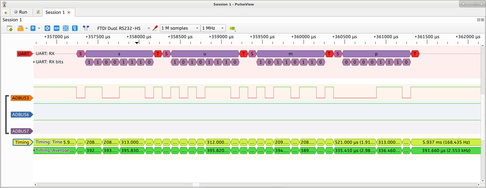

# Sigrok esp 32 

A SUMP compatible Logical Analyser for the esp32, for use with i.e sigrok
https://en.wikipedia.org/wiki/Sigrok

Pins defined for logical input.

```
            12,
            13,
            14,
            15,
```

The key to using the ESP32 with sigrok was using the WROVER kit. :-P
Not the code in this repository... Accidental success. 
I knew there was something strange when the code was working on the first try. It is thanks to the JTAG, chips on the WROVER. Starting pulseview with logging,  -l 5 it seems that the FTDI-LA drivers were used.
https://sigrok.org/gitweb/?p=libsigrok.git;a=tree;f=src/hardware/ftdi-la
For me it solves the problem and allows sampling tp to 10Mhz but maybe the code will be fixed one day.
I found that cutecom allowed sending single HEX bytes, this is useful for debugging the SUMP protocol.


In sigrok the following WROVER pins are mapped
```
PIN13 = ADBUS0
PIN12 = ADBUS1
PIN15 = ADBUS2
PIN14 = ADBUS3
```


THE Jtag interface uses the following pins.
```
1 	CHIP_PU 	TRST_N
2 	MTDO / GPIO15 	TDO
3 	MTDI / GPIO12 	TDI
4 	MTCK / GPIO13 	TCK
5 	MTMS / GPIO14 	TMS
```


Also the following red/green blue led is available on the WROVER kit.
```
  RED    gpio_set_direction(GPIO_NUM_0, GPIO_MODE_OUTPUT);
  GREEN  gpio_set_direction(GPIO_NUM_2, GPIO_MODE_OUTPUT);
  BLUE   gpio_set_direction(GPIO_NUM_4, GPIO_MODE_OUTPUT);
	gpio_set_level(GPIO_NUM_0, 0);
```


After making sure you use the correct Component config → 
ESP32-specific -> Main XTAL frequency
A good idea, might be to set these values.
```
  Bootloader log verbosity (No output)  --->    
  Compiler options ->  Optimization Level (Release (-Os)) 
```


To get some test data, on GPIO_NUM_21 a 30/15 ms pulse is generated with the remote device.
```
app_main() {
    ...
    send_remote_pulses();
    rmt_write_items(config.channel, items, 1, 0);
}
```
When starting the sigrok gui, pulseview, the device was identified and this is how the timing analysis looks like.


[https://raw.githubusercontent.com/Ebiroll/esp32_sigrok/master/sigrok.png ]

# Analysis of UART 9600 Baud
```
static void uartWRITETask(void *inpar) {
  uart_port_t uart_num = UART_NUM_1;    
  echoLine[0]='s';
  echoLine[1]='u';
  echoLine[2]='m';
  echoLine[3]='p';

  while(true) {
    int size = uart_write_bytes(uart_num, (const char *)echoLine, 4);
    vTaskDelay(10 / portTICK_PERIOD_MS);
  }
}
```



# Some other SUMP implementations,

https://github.com/hydrabus/hydrafw/wiki/HydraFW-SUMP-guide

https://github.com/jpbarraca/LogicAlNucleo/blob/master/src/main.cpp

https://github.com/tuxyme/metal-pi/blob/master/analyzer/main.c


https://github.com/gillham/logic_analyzer/blob/master/logic_analyzer.ino
